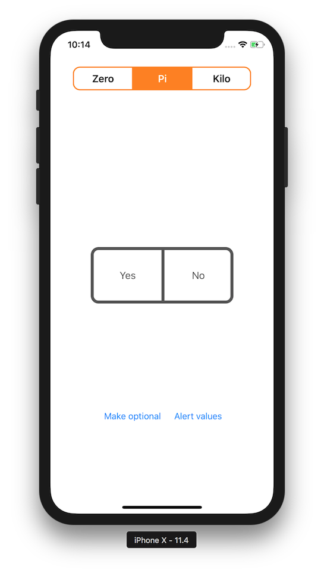

#  OptionalValueSegment

A segment-like control that has optional value selected by default and also can be setted to nil, but gets it´s value on first touch.

The options property is defined as:

```
var options: [(String, Any)]
```

So it can store practically anything:

```
[
  ("Zero", 0.0),
  ("Pi", Double.pi),
  ("Kilo", 1024.0)
]
```

but is setted by default with:

```
[
  ("Yes", true), 
  ("No", false)
]
```


